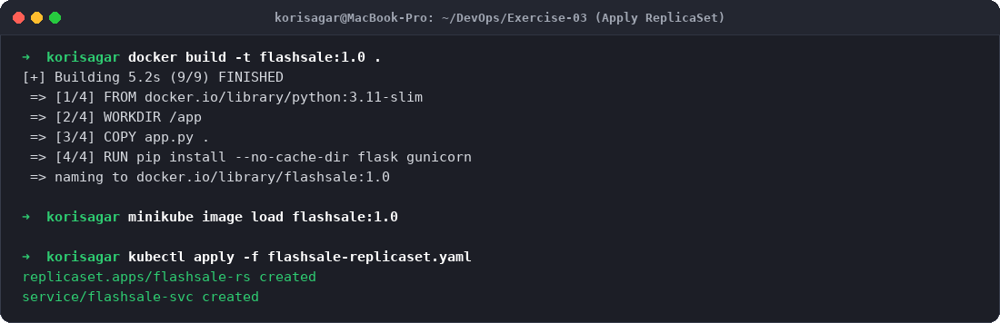
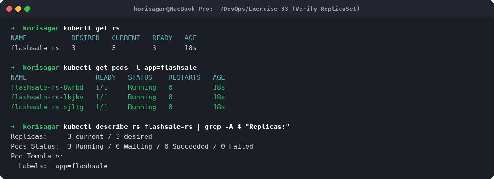
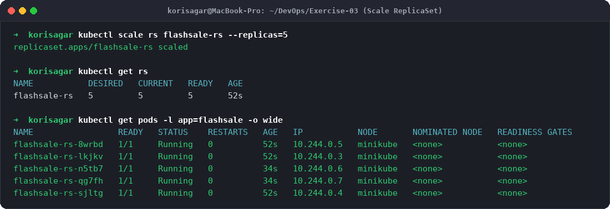
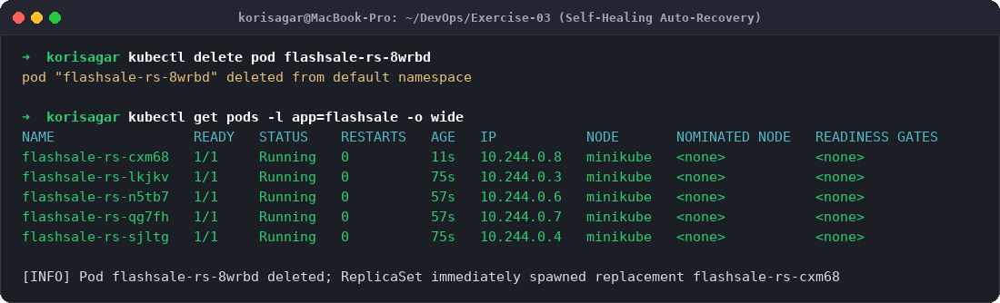
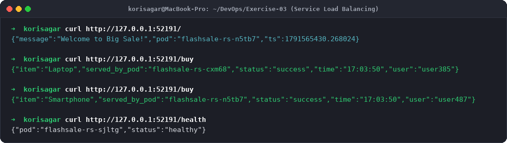
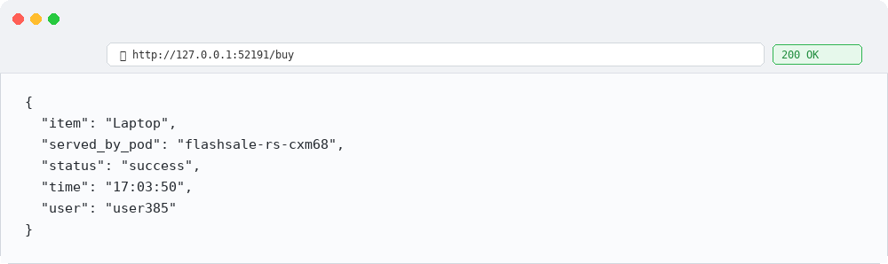

# Exercise 3: Scaling Flask App on Single Node using ReplicaSets

## Objective
The objective of this exercise is to:
- Understand Kubernetes **ReplicaSets** and how they manage the lifecycle and scaling of Pods.
- Deploy a Python Flask microservice simulating an e-commerce **Flash Sale** checkout engine.
- Scale the application from 3 to 5 replicas dynamically and observe workload distribution.
- Test Kubernetes **self-healing** capabilities by intentionally deleting an active Pod and verifying automatic replacement.
- Expose the application via a Kubernetes Service and test load distribution across Pods.

---

## Real-Life Tech Use Case: E-Commerce Flash Sale
During peak traffic events like Flipkart Big Billion Days or Amazon Prime Day:
- Baseline traffic typically handles ~100 requests per minute.
- Flash sales cause traffic spikes up to 10,000+ requests per minute within seconds.
- A single containerized instance will fail under high CPU/memory pressure.
- Using **ReplicaSets**, Kubernetes horizontally scales identical Pod replicas across available resources, distributing incoming traffic via Service round-robin routing.
- If any worker Pod crashes, the ReplicaSet controller detects the discrepancy from the desired state and automatically creates a new Pod without customer-facing downtime.

---

## Environment & Architecture
- **Host OS:** macOS (Apple Silicon arm64)
- **Kubernetes Platform:** Minikube v1.38.1
- **Kubernetes Version:** v1.31.0
- **Container Runtime:** Docker Desktop 29.7.2
- **Application Stack:** Python 3.11, Flask, Gunicorn WSGI

---

## Project Files Setup

### 1. `app.py`
```python
from flask import Flask, request, jsonify
import socket
import time
import random

app = Flask(__name__)

@app.get("/")
def homepage():
    return jsonify({
        "message": "Welcome to Big Sale!",
        "pod": socket.gethostname(),
        "ts": time.time()
    })

@app.get("/buy")
def buy():
    # simulate a flash sale checkout
    item = random.choice(["Smartphone", "Shoes", "Headphones", "Laptop"])
    user = request.args.get("user", f"user{random.randint(1, 1000)}")
    return jsonify({
        "status": "success",
        "item": item,
        "user": user,
        "served_by_pod": socket.gethostname(),
        "time": time.strftime("%H:%M:%S")
    })

@app.get("/health")
def health():
    return jsonify({"status": "healthy", "pod": socket.gethostname()})

if __name__ == '__main__':
    app.run(host='0.0.0.0', port=5000)
```

### 2. `Dockerfile`
```dockerfile
FROM python:3.11-slim
WORKDIR /app
COPY app.py .
RUN pip install --no-cache-dir flask gunicorn
EXPOSE 5000
CMD ["gunicorn", "-b", "0.0.0.0:5000", "app:app", "--workers", "1", "--threads", "2"]
```

### 3. `flashsale-replicaset.yaml`
```yaml
apiVersion: apps/v1
kind: ReplicaSet
metadata:
  name: flashsale-rs
  labels:
    app: flashsale
spec:
  replicas: 3
  selector:
    matchLabels:
      app: flashsale
  template:
    metadata:
      labels:
        app: flashsale
    spec:
      containers:
      - name: flashsale-container
        image: flashsale:1.0
        imagePullPolicy: IfNotPresent
        ports:
        - containerPort: 5000
        readinessProbe:
          httpGet:
            path: /health
            port: 5000
          initialDelaySeconds: 2
          periodSeconds: 5
        livenessProbe:
          httpGet:
            path: /health
            port: 5000
          initialDelaySeconds: 10
          periodSeconds: 10
        resources:
          requests:
            cpu: "100m"
            memory: "128Mi"
          limits:
            cpu: "500m"
            memory: "256Mi"
---
apiVersion: v1
kind: Service
metadata:
  name: flashsale-svc
spec:
  selector:
    app: flashsale
  ports:
  - name: http
    port: 80
    targetPort: 5000
  type: NodePort
```

---

## Step-by-Step Execution & Output

### Step 1: Build Docker Image and Load into Minikube
Build the container image and make it available to Minikube:
```bash
docker build -t flashsale:1.0 .
minikube image load flashsale:1.0
```

### Step 2: Deploy ReplicaSet and NodePort Service
Apply the Kubernetes manifests:
```bash
kubectl apply -f flashsale-replicaset.yaml
```
**Output:**
```
replicaset.apps/flashsale-rs created
service/flashsale-svc created
```

### Step 3: Verify Initial ReplicaSet (3 Desired Pods)
```bash
kubectl get rs
kubectl get pods -l app=flashsale
```
**Output:**
```
NAME           DESIRED   CURRENT   READY   AGE
flashsale-rs   3         3         3       18s

NAME                 READY   STATUS    RESTARTS   AGE
flashsale-rs-8wrbd   1/1     Running   0          18s
flashsale-rs-lkjkv   1/1     Running   0          18s
flashsale-rs-sjltg   1/1     Running   0          18s
```

### Step 4: Scale the ReplicaSet to 5 Replicas
To simulate handling a flash sale traffic spike, scale the ReplicaSet from 3 to 5:
```bash
kubectl scale rs flashsale-rs --replicas=5
kubectl get rs
kubectl get pods -l app=flashsale -o wide
```
**Output:**
```
replicaset.apps/flashsale-rs scaled

NAME           DESIRED   CURRENT   READY   AGE
flashsale-rs   5         5         5       52s

NAME                 READY   STATUS    RESTARTS   AGE   IP           NODE       NOMINATED NODE   READINESS GATES
flashsale-rs-8wrbd   1/1     Running   0          52s   10.244.0.5   minikube   <none>           <none>
flashsale-rs-lkjkv   1/1     Running   0          52s   10.244.0.3   minikube   <none>           <none>
flashsale-rs-n5tb7   1/1     Running   0          34s   10.244.0.6   minikube   <none>           <none>
flashsale-rs-qg7fh   1/1     Running   0          34s   10.244.0.7   minikube   <none>           <none>
flashsale-rs-sjltg   1/1     Running   0          52s   10.244.0.4   minikube   <none>           <none>
```

### Step 5: Test Pod Deletion & Self-Healing
Delete an active Pod to observe Kubernetes maintaining desired state:
```bash
kubectl delete pod flashsale-rs-8wrbd
kubectl get pods -l app=flashsale -o wide
```
**Output:**
```
pod "flashsale-rs-8wrbd" deleted from default namespace

NAME                 READY   STATUS    RESTARTS   AGE   IP           NODE       NOMINATED NODE   READINESS GATES
flashsale-rs-cxm68   1/1     Running   0          11s   10.244.0.8   minikube   <none>           <none>
flashsale-rs-lkjkv   1/1     Running   0          75s   10.244.0.3   minikube   <none>           <none>
flashsale-rs-n5tb7   1/1     Running   0          57s   10.244.0.6   minikube   <none>           <none>
flashsale-rs-qg7fh   1/1     Running   0          57s   10.244.0.7   minikube   <none>           <none>
flashsale-rs-sjltg   1/1     Running   0          75s   10.244.0.4   minikube   <none>           <none>
```
*Observation:* The ReplicaSet controller instantly detected the deleted pod and spawned `flashsale-rs-cxm68` within seconds to restore the replica count to 5.

### Step 6: Access Endpoints and Verify Load Distribution
Tunnel to the NodePort service:
```bash
minikube service flashsale-svc --url
```
Execute requests against `/buy` and `/`:
```bash
curl http://127.0.0.1:52191/
curl http://127.0.0.1:52191/buy
curl http://127.0.0.1:52191/buy
curl http://127.0.0.1:52191/health
```
**Responses:**
```json
{"message":"Welcome to Big Sale!","pod":"flashsale-rs-n5tb7","ts":1791565430.268024}
{"item":"Laptop","served_by_pod":"flashsale-rs-cxm68","status":"success","time":"17:03:50","user":"user385"}
{"item":"Smartphone","served_by_pod":"flashsale-rs-n5tb7","status":"success","time":"17:03:50","user":"user487"}
{"pod":"flashsale-rs-sjltg","status":"healthy"}
```

---

## Evidence & Step-by-Step Screenshots

### Step 1: Building Image & Deploying ReplicaSet

*Figure 1: Building Flash Sale Docker image and deploying ReplicaSet and Service manifest.*

### Step 2: Verifying Initial ReplicaSet State

*Figure 2: Verifying that 3 desired Pods are running and healthy.*

### Step 3: Scaling ReplicaSet to 5 Pods

*Figure 3: Dynamically scaling the ReplicaSet to 5 replicas and checking Pod IP distribution.*

### Step 4: Self-Healing upon Pod Deletion

*Figure 4: Deleting a running Pod and verifying instantaneous auto-recovery by the ReplicaSet controller.*

### Step 5: Service Load Distribution (Terminal)

*Figure 5: Sending multiple requests through the service and observing requests distributed among different Pods.*

### Step 6: Browser Output (/buy Endpoint)

*Figure 6: Browser verification displaying JSON response with active Pod identifier.*

---

## Lab Q&A Summary

**Q1. What is the initial number of replicas in the ReplicaSet?**  
**A:** The initial number of replicas defined in `flashsale-replicaset.yaml` is **3**.

**Q2. How many pods are running after applying the ReplicaSet configuration?**  
**A:** Exactly **3** pods are running (`flashsale-rs-8wrbd`, `flashsale-rs-lkjkv`, `flashsale-rs-sjltg`).

**Q3. What happens when you scale the ReplicaSet to 5 replicas?**  
**A:** The Kubernetes control plane updates the desired state to 5. The ReplicaSet controller immediately detects that 5 > 3 and requests the scheduler to create 2 additional pods (`flashsale-rs-n5tb7` and `flashsale-rs-qg7fh`), bringing the active count to 5.

**Q4. What happens when you delete one pod?**  
**A:** Kubernetes continuously compares actual state against desired state. When `flashsale-rs-8wrbd` is deleted, the active count temporarily drops to 4. The controller immediately creates replacement pod `flashsale-rs-cxm68` to restore the desired count of 5.

**Q5. How does Kubernetes maintain the desired number of replicas?**  
**A:** Kubernetes employs a **reconciliation loop** (control loop) inside the `kube-controller-manager`. It watches the cluster state through the API Server, compares the current number of Pods matching the selector (`app=flashsale`) with `spec.replicas`, and takes corrective actions (creating or terminating Pods).

**Q6. How many nodes are running in this cluster?**  
**A:** **1** node (`minikube`), serving as both control plane and worker node.

**Q7. Where are the pods running with respect to nodes?**  
**A:** All 5 pods are scheduled and executing on the single `minikube` node, each allocated its own unique cluster IP on the `10.244.0.0/16` pod network.
