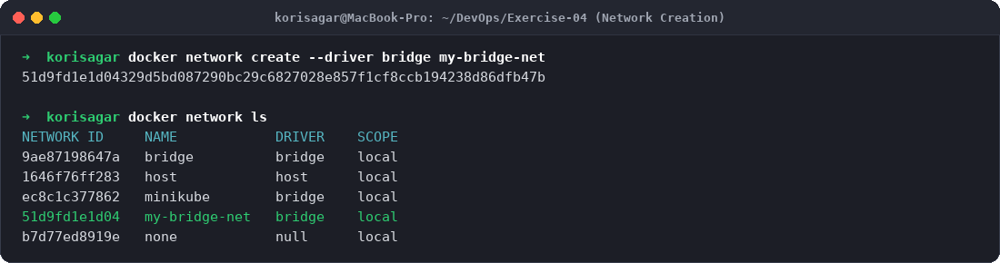
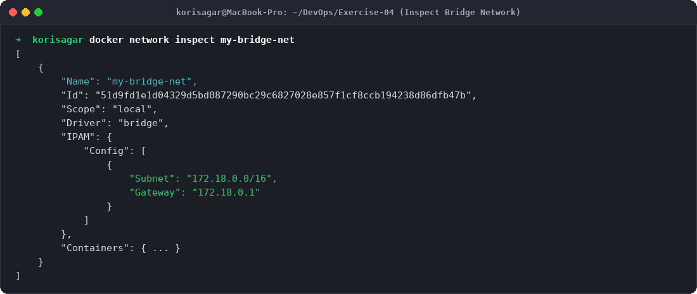
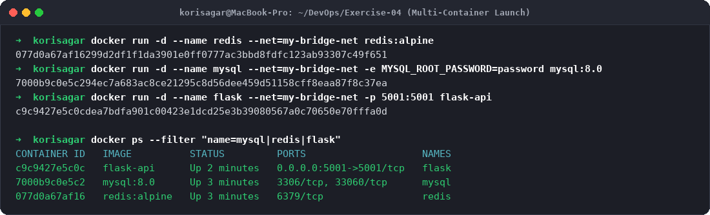
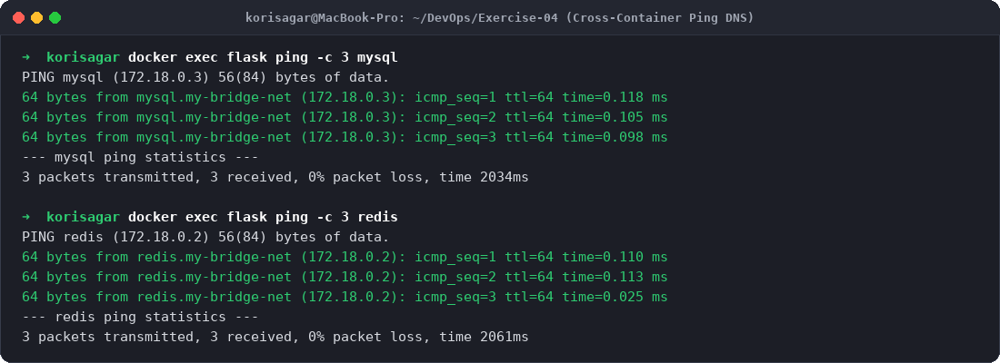
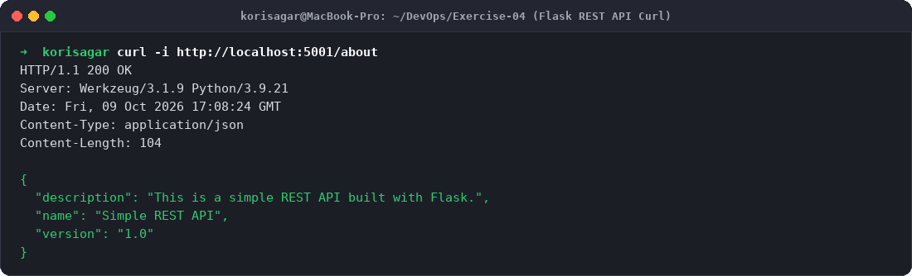
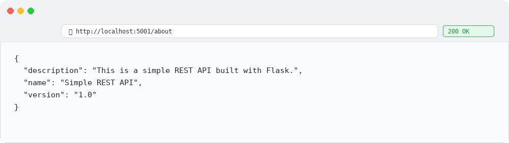

# Exercise 4: Docker Networking with Multiple Containers

## Objective
The objective of this exercise is to:
- Understand core Docker networking architectures and isolation models.
- Create and inspect a custom user-defined **Bridge Network** (`my-bridge-net`).
- Deploy a multi-tier microservice architecture:
  - **Python Flask REST API** (Container 1)
  - **MySQL Database Server** (Container 2)
  - **Redis In-Memory Cache** (Container 3)
- Verify automatic DNS name resolution and inter-container connectivity across the bridge network.
- Test external access to the Flask REST API via host port forwarding (`-p 5001:5001`).

---

## Scenario & Microservice Architecture
In modern containerized deployments, backend services such as databases (MySQL) and caching layers (Redis) must communicate privately and securely without exposing their internal ports directly to the outside world.
- A custom **Bridge Network** provides an isolated software bridge where containers are assigned private IP addresses.
- Unlike the default legacy docker0 bridge, user-defined bridge networks provide **automatic DNS service discovery**, enabling containers to resolve each other by container name (e.g., `ping mysql`, `ping redis`) rather than brittle hardcoded IP addresses.

---

## Environment Setup
- **OS:** macOS (Apple Silicon arm64)
- **Container Runtime:** Docker Desktop 29.7.2
- **Network Driver:** `bridge`
- **Subnet:** `172.18.0.0/16` | **Gateway:** `172.18.0.1`

---

## Project Files Setup

### 1. `app.py`
```python
from flask import Flask, jsonify

app = Flask(__name__)

@app.route('/about', methods=['GET'])
def about():
    return jsonify({
        "name": "Simple REST API",
        "version": "1.0",
        "description": "This is a simple REST API built with Flask."
    })

if __name__ == '__main__':
    app.run(host='0.0.0.0', port=5001)
```

### 2. `requirements.txt`
```
Flask==2.3.3
```

### 3. `Dockerfile`
```dockerfile
FROM python:3.9-slim

WORKDIR /app

# Install ping and curl utilities for network connectivity testing
RUN apt-get update && apt-get install -y --no-install-recommends iputils-ping curl && rm -rf /var/lib/apt/lists/*

COPY requirements.txt .
COPY app.py .

RUN pip install --no-cache-dir -r requirements.txt

EXPOSE 5001

CMD ["python", "app.py"]
```

---

## Step-by-Step Execution & Output

### Task 1: Create a Custom Bridge Network
Create a user-defined bridge network named `my-bridge-net`:
```bash
docker network create --driver bridge my-bridge-net
```
**Output:**
```
51d9fd1e1d04329d5bd087290bc29c6827028e857f1cf8ccb194238d86dfb47b
```

### Task 2: Verify the Network
List active Docker networks:
```bash
docker network ls
```
**Output:**
```
NETWORK ID     NAME            DRIVER    SCOPE
9ae87198647a   bridge          bridge    local
1646f76ff283   host            host      local
ec8c1c377862   minikube        bridge    local
51d9fd1e1d04   my-bridge-net   bridge    local
b7d77ed8919e   none            null      local
```

### Task 3: Inspect the Network Configuration
Inspect subnet allocation and IPAM settings:
```bash
docker network inspect my-bridge-net
```
**Output:**
```json
[
    {
        "Name": "my-bridge-net",
        "Id": "51d9fd1e1d04329d5bd087290bc29c6827028e857f1cf8ccb194238d86dfb47b",
        "Scope": "local",
        "Driver": "bridge",
        "EnableIPv4": true,
        "IPAM": {
            "Driver": "default",
            "Config": [
                {
                    "Subnet": "172.18.0.0/16",
                    "Gateway": "172.18.0.1"
                }
            ]
        }
    }
]
```

### Task 4: Launch Multi-Tier Containers
Build the Flask REST API and launch all three containers attached to `my-bridge-net`:
```bash
docker build -t flask-api .
docker run -d --name redis --net=my-bridge-net redis:alpine
docker run -d --name mysql --net=my-bridge-net -e MYSQL_ROOT_PASSWORD=password mysql:8.0
docker run -d --name flask --net=my-bridge-net -p 5001:5001 flask-api
```
Verify container status:
```bash
docker ps --filter "name=mysql|redis|flask"
```
**Output:**
```
CONTAINER ID   IMAGE          STATUS         PORTS                                         NAMES
c9c9427e5c0c   flask-api      Up 2 minutes   0.0.0.0:5001->5001/tcp, [::]:5001->5001/tcp   flask
7000b9c0e5c2   mysql:8.0      Up 3 minutes   3306/tcp, 33060/tcp                           mysql
077d0a67af16   redis:alpine   Up 3 minutes   6379/tcp                                      redis
```

Inspect assigned container IPs on `my-bridge-net`:
- `redis`: `172.18.0.2/16`
- `mysql`: `172.18.0.3/16`
- `flask`: `172.18.0.4/16`

### Task 5: Test Inter-Container Connectivity (DNS & Ping)
Execute into the `flask` container and ping `mysql` and `redis` by hostname:
```bash
docker exec flask ping -c 3 mysql
docker exec flask ping -c 3 redis
```
**Output:**
```
PING mysql (172.18.0.3) 56(84) bytes of data.
64 bytes from mysql.my-bridge-net (172.18.0.3): icmp_seq=1 ttl=64 time=0.118 ms
64 bytes from mysql.my-bridge-net (172.18.0.3): icmp_seq=2 ttl=64 time=0.105 ms
64 bytes from mysql.my-bridge-net (172.18.0.3): icmp_seq=3 ttl=64 time=0.098 ms

--- mysql ping statistics ---
3 packets transmitted, 3 received, 0% packet loss, time 2034ms
rtt min/avg/max/mdev = 0.098/0.107/0.118/0.008 ms

PING redis (172.18.0.2) 56(84) bytes of data.
64 bytes from redis.my-bridge-net (172.18.0.2): icmp_seq=1 ttl=64 time=0.110 ms
64 bytes from redis.my-bridge-net (172.18.0.2): icmp_seq=2 ttl=64 time=0.113 ms
64 bytes from redis.my-bridge-net (172.18.0.2): icmp_seq=3 ttl=64 time=0.025 ms

--- redis ping statistics ---
3 packets transmitted, 3 received, 0% packet loss, time 2061ms
rtt min/avg/max/mdev = 0.025/0.082/0.113/0.040 ms
```

### Task 6: Test Host Port Exposure via Curl
Access the Flask API published on host port `5001`:
```bash
curl -i http://localhost:5001/about
```
**Output:**
```
HTTP/1.1 200 OK
Content-Type: application/json
Content-Length: 104

{
  "description": "This is a simple REST API built with Flask.",
  "name": "Simple REST API",
  "version": "1.0"
}
```

---

## Evidence & Step-by-Step Screenshots

### Step 1: Create and Verify Bridge Network

*Figure 1: Creating `my-bridge-net` and verifying network list.*

### Step 2: Inspect Network Subnet & Gateway

*Figure 2: Inspecting IPAM subnet configuration (`172.18.0.0/16`).*

### Step 3: Launch Multi-Tier Containers

*Figure 3: Starting MySQL, Redis, and Flask containers on the bridge network.*

### Step 4: Test Inter-Container DNS Ping Connectivity

*Figure 4: Pinging MySQL and Redis from Flask using container DNS hostnames with 0% packet loss.*

### Step 5: Terminal Curl REST API Verification

*Figure 5: Curled `http://localhost:5001/about` returning HTTP 200 and JSON response.*

### Step 6: Browser Output (/about Endpoint)

*Figure 6: Browser accessing the Flask microservice through host port 5001.*

---

## Lab Q&A Summary

**Q1. What is the purpose of the `--net` flag in `docker run`?**  
**A:** The `--net` (or `--network`) flag specifies which network a newly created container attaches to. Attaching containers to the same custom bridge network allows them to communicate privately via internal IPs and DNS names.

**Q2. How do containers communicate with each other on the same network?**  
**A:** On a user-defined bridge network, Docker runs an embedded DNS server at `127.0.0.11`. Containers can resolve each other by container name (e.g., `mysql`, `redis`), or communicate directly via their assigned bridge IP addresses (`172.18.0.x`).

**Q3. What is the difference between a bridge network and a host network?**  
**A:** 
- **Bridge Network:** Containers reside inside an isolated private network namespace with their own virtual Ethernet interfaces (`veth`) and private IP subnet. Traffic to the host is NAT-routed or port-mapped.
- **Host Network:** Containers share the host's networking namespace directly without isolation. The container has no private IP of its own and binds directly to the host's ports.

**Q4. How can you expose a container's port to the host machine?**  
**A:** Using the `-p <host_port>:<container_port>` flag (e.g., `-p 5001:5001`). Docker sets up iptables/packet forwarding rules that redirect incoming host traffic on that port directly into the container's virtual network interface.
