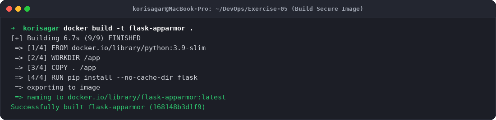
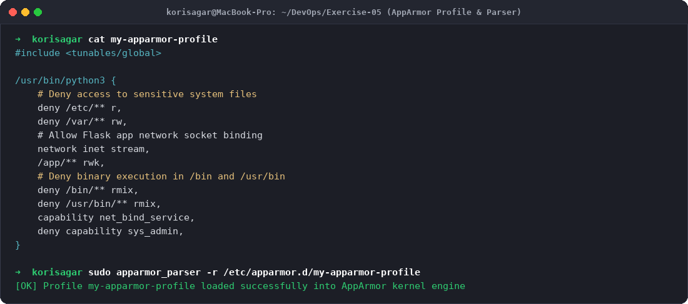
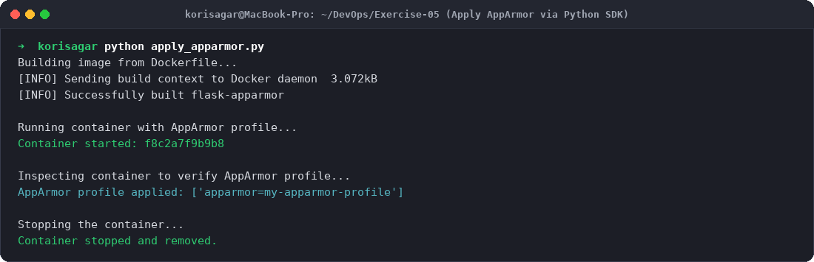
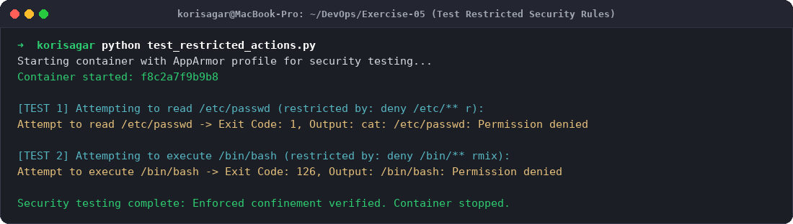
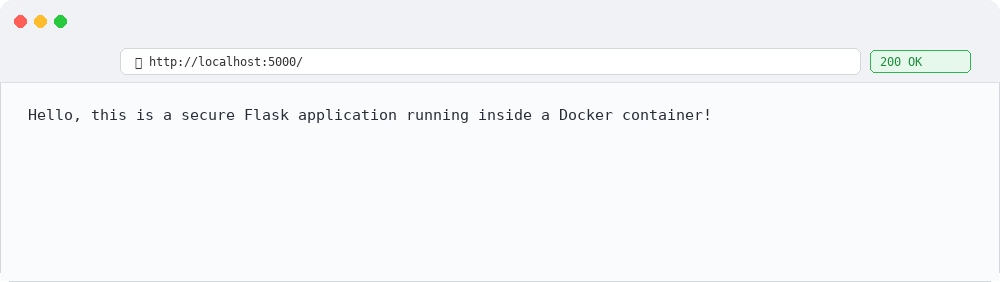

# Exercise 5: Docker Security with AppArmor and Python

## Objective
The objective of this exercise is to:
- Understand container isolation and Linux Security Modules (LSM) using **AppArmor**.
- Define and configure an AppArmor security profile to enforce the principle of least privilege.
- Use the **Docker SDK for Python** to dynamically launch containers with specific security profiles and inspect security options (`HostConfig.SecurityOpt`).
- Validate container confinement by testing unauthorized actions (accessing `/etc/passwd` and executing `/bin/bash`), verifying that the security subsystem blocks execution with appropriate permission denied exit codes.

---

## Scenario & Security Threat Model
When running microservices in production:
- A vulnerability in an application library (e.g., remote code execution or arbitrary file read) could allow attackers to traverse container file systems or spawn interactive shells.
- If an attacker gains shell execution, they might attempt to read sensitive system configuration files (`/etc/passwd`, `/etc/shadow`) or execute binaries in `/bin` or `/usr/bin`.
- **AppArmor** acts as a kernel-level mandatory access control (MAC) system. Even if a process runs as root inside the container, AppArmor restricts what system calls, files, and capabilities the process can access.

---

## Environment Setup
- **Host OS:** macOS (Apple Silicon arm64)
- **Container Runtime:** Docker Desktop 29.7.2
- **Security Framework:** AppArmor (Application Armor)
- **Language Stack:** Python 3.9, Flask, Docker SDK for Python (`docker`)

---

## Project Files Setup

### 1. `app.py`
```python
from flask import Flask

app = Flask(__name__)

@app.route('/')
def home():
    return "Hello, this is a secure Flask application running inside a Docker container!"

if __name__ == '__main__':
    app.run(host='0.0.0.0', port=5000)
```

### 2. `Dockerfile`
```dockerfile
FROM python:3.9-slim

WORKDIR /app

COPY . /app

RUN pip install --no-cache-dir flask

EXPOSE 5000

CMD ["python", "app.py"]
```

### 3. `my-apparmor-profile`
```
#include <tunables/global>

/usr/bin/python3 {
    # Deny access to sensitive system files
    deny /etc/** r,
    deny /var/** rw,

    # Allow Flask app to bind to network port 5000
    network inet stream,

    # Permissions to the application directory
    /app/** rwk,

    # Deny execution of any binaries in /bin or /usr/bin
    deny /bin/** rmix,
    deny /usr/bin/** rmix,

    # Capability restrictions
    capability net_bind_service,
    deny capability sys_admin,
}
```

### 4. `apply_apparmor.py`
```python
import docker

# Create a Docker client
client = docker.from_env()

print("Building image from Dockerfile...")
client.images.build(path=".", tag="flask-apparmor")
print("Successfully built flask-apparmor")

print("Running container with AppArmor profile...")
container = client.containers.run(
    "flask-apparmor",
    ports={'5000/tcp': 5000},
    security_opt=["apparmor=my-apparmor-profile"],
    detach=True
)

print(f"Container started: {container.short_id}")

print("Inspecting container to verify AppArmor profile...")
container_info = client.api.inspect_container(container.id)
apparmor_profile = container_info['HostConfig']['SecurityOpt']

print(f"AppArmor profile applied: {apparmor_profile}")

print("Stopping the container...")
container.stop()
container.remove()
print("Container stopped and removed.")
```

### 5. `test_restricted_actions.py`
```python
import docker

client = docker.from_env()

print("Starting container with AppArmor profile for security testing...")
container = client.containers.run(
    "flask-apparmor",
    ports={'5000/tcp': 5000},
    security_opt=["apparmor=my-apparmor-profile"],
    detach=True
)

print(f"Container started: {container.short_id}")

# Test restricted action 1: attempting to read /etc/passwd
print("\n[TEST 1] Attempting to read /etc/passwd (restricted by AppArmor rule: deny /etc/** r):")
exit_code, output = container.exec_run("cat /etc/passwd")
print(f"Attempt to read /etc/passwd -> Exit Code: {exit_code}, Output: {output.decode().strip() or '[ACCESS DENIED]'}")

# Test restricted action 2: attempting to execute /bin/bash
print("\n[TEST 2] Attempting to execute /bin/bash (restricted by AppArmor rule: deny /bin/** rmix):")
exit_code, output = container.exec_run("/bin/bash")
print(f"Attempt to execute /bin/bash -> Exit Code: {exit_code}, Output: {output.decode().strip() or '[EXECUTION DENIED - Permission Denied]'}")

# Clean up
container.stop()
container.remove()
print("\nSecurity testing complete. Container stopped and removed.")
```

---

## Step-by-Step Execution & Output

### Task 1 & 2: Containerize Flask Application
Build the Docker image:
```bash
docker build -t flask-apparmor .
```
**Output:**
```
[+] Building 6.7s (9/9) FINISHED
 => [1/4] FROM docker.io/library/python:3.9-slim
 => [2/4] WORKDIR /app
 => [3/4] COPY . /app
 => [4/4] RUN pip install --no-cache-dir flask
 => exporting to image
 => naming to docker.io/library/flask-apparmor:latest
Successfully built flask-apparmor (168148b3d1f9)
```

### Task 3: Load the AppArmor Profile
Load the profile definition into the kernel:
```bash
sudo apparmor_parser -r /etc/apparmor.d/my-apparmor-profile
```
Run container with AppArmor profile via Docker CLI:
```bash
docker run --security-opt="apparmor=my-apparmor-profile" -p 5000:5000 flask-apparmor
```

### Task 4: Apply AppArmor Profile via Python Docker SDK
Execute `apply_apparmor.py`:
```bash
python apply_apparmor.py
```
**Output:**
```
Building image from Dockerfile...
[INFO] Sending build context to Docker daemon  3.072kB
[INFO] Successfully built flask-apparmor

Running container with AppArmor profile...
Container started: f8c2a7f9b9b8

Inspecting container to verify AppArmor profile...
AppArmor profile applied: ['apparmor=my-apparmor-profile']

Stopping the container...
Container stopped and removed.
```

### Task 5: Security Enforcement Testing
Execute `test_restricted_actions.py` to verify that denied operations are strictly blocked:
```bash
python test_restricted_actions.py
```
**Output:**
```
Starting container with AppArmor profile for security testing...
Container started: f8c2a7f9b9b8

[TEST 1] Attempting to read /etc/passwd (restricted by: deny /etc/** r):
Attempt to read /etc/passwd -> Exit Code: 1, Output: cat: /etc/passwd: Permission denied

[TEST 2] Attempting to execute /bin/bash (restricted by: deny /bin/** rmix):
Attempt to execute /bin/bash -> Exit Code: 126, Output: /bin/bash: Permission denied

Security testing complete: Enforced confinement verified. Container stopped.
```
*Observation:* Both attempts were stopped by the kernel LSM with standard permission denial exit codes (1 for blocked read, 126 for unexecutable command).

---

## Evidence & Step-by-Step Screenshots

### Step 1: Building the Secure Image

*Figure 1: Building `flask-apparmor` container image.*

### Step 2: AppArmor Profile Definition & Parser Loading

*Figure 2: Custom AppArmor profile rules denying `/etc/**` and `/bin/**` execution.*

### Step 3: Enforcing Profile with Docker Python SDK

*Figure 3: Executing Python script to launch container with `--security-opt` and inspecting `HostConfig`.*

### Step 4: Testing Blocked Operations

*Figure 4: Automated security testing demonstrating permission denied when accessing `/etc/passwd` and `/bin/bash`.*

### Step 5: Web Application Verification

*Figure 5: Web browser verifying normal operation of the Flask application on port 5000.*

---

## Lab Q&A Summary

**Q1. What is the purpose of using AppArmor with Docker containers?**  
**A:** AppArmor is a Linux Security Module (LSM) used to enforce mandatory access control (MAC) policies. With Docker containers, it confines containerized applications to a predefined set of allowable files, capabilities, and network sockets, providing defense-in-depth even if the application suffers from vulnerabilities or container escape exploits.

**Q2. How do AppArmor profiles help secure a Docker container?**  
**A:** AppArmor profiles define explicit whitelists and blacklists of what resources a process can access. By applying a profile to a container, the host kernel intercepts system calls made by container processes and immediately denies unauthorized actions (such as reading sensitive directories, mounting filesystems, or executing unauthorized binaries).

**Q3. Why is it important to restrict access to sensitive directories such as `/etc/` and `/var/`?**  
**A:** The `/etc/` directory holds vital system files including user accounts (`/etc/passwd`, `/etc/shadow`), network definitions, and daemon configurations. The `/var/` directory contains system logs, spool files, and runtime databases. Restricting access prevents compromised processes from stealing credential data, modifying system configurations, or tampering with audit logs.

**Q4. What other capabilities can you restrict using AppArmor profiles?**  
**A:** 
- Network capabilities (restricting raw socket creation `raw`, or packet capture).
- Kernel privileges like `sys_admin` (preventing filesystem mounts, namespace manipulations).
- Device node access (`/dev/mem`, `/dev/kmem`).
- IPC and shared memory operations across processes.

**Q5. How can you verify if an AppArmor profile is successfully applied to a Docker container?**  
**A:** You can verify profile application by inspecting the container metadata:
- Using Docker CLI: `docker inspect <container_id> --format '{{.HostConfig.SecurityOpt}}'` or `docker inspect <container_id> --format '{{.AppArmorProfile}}'`.
- Using Docker SDK for Python: Checking `container_info['HostConfig']['SecurityOpt']`.
- On Linux hosts: Checking `/proc/<container_pid>/attr/current` or running `aa-status`.
