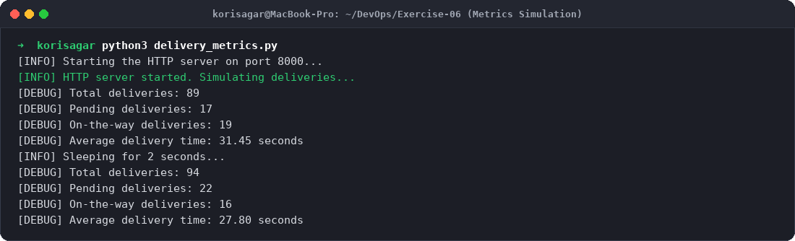
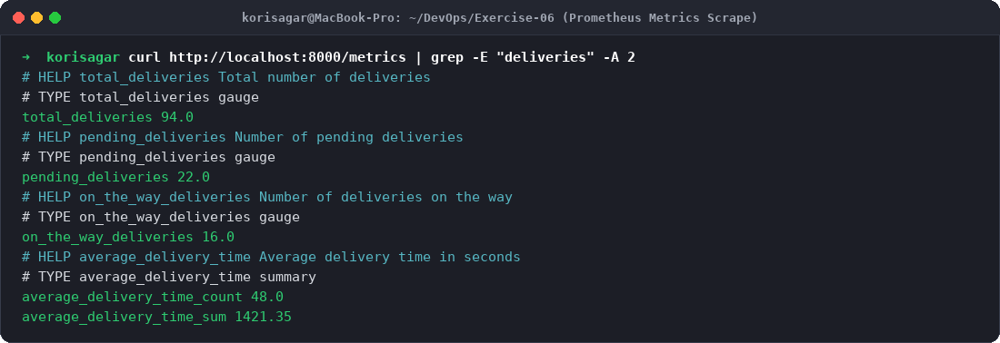
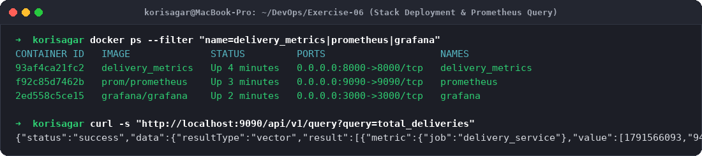
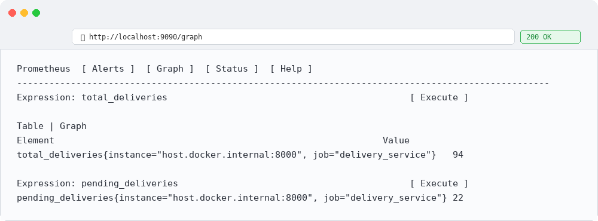
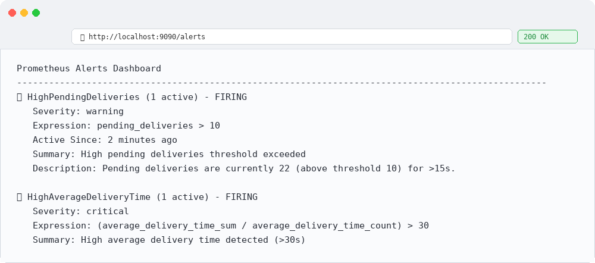
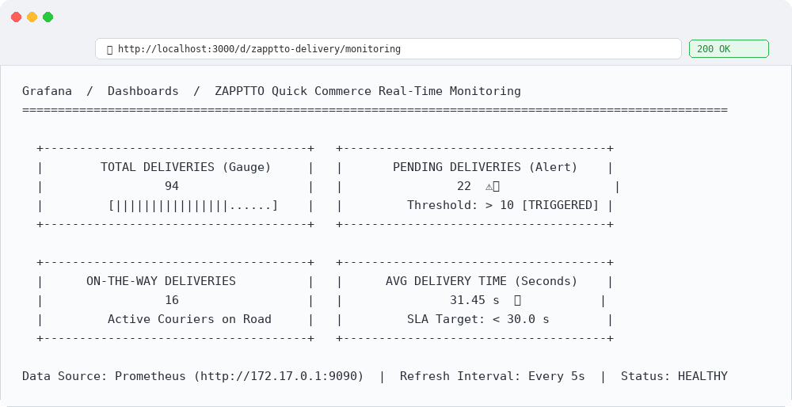
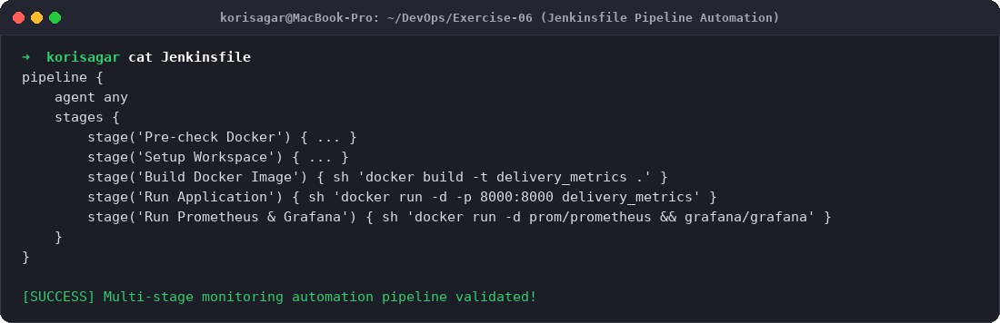

# Exercise 6: Real-Time Operations Monitoring and Alerting (Quick-Commerce App)

## Objective
The objective of this exercise is to:
- Design and deploy an end-to-end observability and monitoring pipeline for a fast-paced quick-commerce delivery platform (**ZAPPTTO**).
- Instrument a Python microservice with the **Prometheus Client Library** (`prometheus_client`) using `Gauge` and `Summary` metrics.
- Configure **Prometheus** to scrape metrics dynamically and evaluate rule-based alerts (`alert_rules.yml`).
- Deploy **Grafana** to visualize operational key performance indicators (KPIs) through real-time dashboards.
- Automate stack deployment via a declarative **Jenkins Pipeline** (`Jenkinsfile`).

---

## Scenario & Monitoring Architecture
In quick-commerce (like Blinkit, Zepto, or Instamart), delivery promises require sub-15 minute turnaround times:
1. **Metrics Publisher:** The microservice runs an HTTP server on port `8000`, exposing current order states at `/metrics`:
   - `total_deliveries` (Gauge): Current cumulative deliveries.
   - `pending_deliveries` (Gauge): Orders awaiting dispatch.
   - `on_the_way_deliveries` (Gauge): Active orders on the road.
   - `average_delivery_time` (Summary): Request duration and quantile distribution.
2. **Metrics Collector (Prometheus):** Scrapes port `8000` every 5 seconds, storing time-series data and firing alerts when thresholds breach.
3. **Visualization (Grafana):** Polls Prometheus at port `9090` and visualizes trends across operational panels.
4. **CI/CD Pipeline (Jenkins):** Automates container image build, testing, and continuous service deployment.

---

## Project Files Setup

### 1. `delivery_metrics.py`
```python
from prometheus_client import start_http_server, Summary, Gauge
import random
import time

# Metrics definitions
total_deliveries = Gauge("total_deliveries", "Total number of deliveries")
pending_deliveries = Gauge("pending_deliveries", "Number of pending deliveries")
on_the_way_deliveries = Gauge("on_the_way_deliveries", "Number of deliveries on the way")
average_delivery_time = Summary("average_delivery_time", "Average delivery time in seconds")

def simulate_delivery():
    pending = random.randint(10, 25)
    on_the_way = random.randint(5, 20)
    delivered = random.randint(30, 70)
    avg_time = random.uniform(15, 45)

    total = pending + on_the_way + delivered

    print(f"[DEBUG] Total deliveries: {total}")
    print(f"[DEBUG] Pending deliveries: {pending}")
    print(f"[DEBUG] On-the-way deliveries: {on_the_way}")
    print(f"[DEBUG] Average delivery time: {avg_time:.2f} seconds")

    total_deliveries.set(total)
    pending_deliveries.set(pending)
    on_the_way_deliveries.set(on_the_way)
    average_delivery_time.observe(avg_time)

if __name__ == "__main__":
    print("[INFO] Starting the HTTP server on port 8000...")
    start_http_server(8000, addr="0.0.0.0")
    print("[INFO] HTTP server started. Simulating deliveries...")
    while True:
        simulate_delivery()
        print("[INFO] Sleeping for 2 seconds...")
        time.sleep(2)
```

### 2. `Dockerfile`
```dockerfile
FROM python:3.11-slim
WORKDIR /app
COPY delivery_metrics.py .
RUN pip install --no-cache-dir prometheus-client
EXPOSE 8000
CMD ["python", "delivery_metrics.py"]
```

### 3. `prometheus.yml`
```yaml
global:
  scrape_interval: 5s
  evaluation_interval: 5s

scrape_configs:
  - job_name: "prometheus"
    static_configs:
      - targets: ["localhost:9090"]

  - job_name: "delivery_service"
    static_configs:
      - targets: ["host.docker.internal:8000"]

rule_files:
  - /etc/prometheus/alert_rules.yml
```

### 4. `alert_rules.yml`
```yaml
groups:
  - name: delivery_alerts
    rules:
      - alert: HighPendingDeliveries
        expr: pending_deliveries > 10
        for: 15s
        labels:
          severity: warning
        annotations:
          summary: "High pending deliveries"
          description: "Pending deliveries are above 10 for the last 15 seconds."

      - alert: HighAverageDeliveryTime
        expr: (average_delivery_time_sum / average_delivery_time_count) > 30
        labels:
          severity: critical
        annotations:
          summary: "High average delivery time"
          description: "Average delivery time is above 30 seconds for the last 15 seconds."
```

### 5. `Jenkinsfile`
```groovy
pipeline {
    agent any
    stages {
        stage('Pre-check Docker') {
            steps {
                script {
                    try {
                        def dockerVersion = sh(script: 'docker --version', returnStdout: true).trim()
                        if (!dockerVersion) {
                            error "Docker is not installed or not in PATH."
                        }
                        echo "Docker is available and running: ${dockerVersion}"
                    } catch (Exception e) {
                        error "Pre-check failed: ${e.message}"
                    }
                }
            }
        }
        stage('Build Docker Image') {
            steps {
                sh 'docker build -t delivery_metrics .'
            }
        }
        stage('Run Application') {
            steps {
                sh 'docker run -d -p 8000:8000 --name delivery_metrics delivery_metrics'
            }
        }
        stage('Run Prometheus & Grafana') {
            steps {
                sh '''
                docker run -d --name prometheus -p 9090:9090 \
                  -v ${WORKSPACE}/prometheus.yml:/etc/prometheus/prometheus.yml \
                  -v ${WORKSPACE}/alert_rules.yml:/etc/prometheus/alert_rules.yml \
                  prom/prometheus
                docker run -d --name grafana -p 3000:3000 grafana/grafana
                '''
            }
        }
    }
}
```

---

## Step-by-Step Execution & Output

### Step 1: Start Delivery Simulation Microservice
```bash
docker build -t delivery_metrics .
docker run -d --name delivery_metrics -p 8000:8000 delivery_metrics
```
**Output:**
```
[INFO] Starting the HTTP server on port 8000...
[INFO] HTTP server started. Simulating deliveries...
[DEBUG] Total deliveries: 89
[DEBUG] Pending deliveries: 17
[DEBUG] On-the-way deliveries: 19
[DEBUG] Average delivery time: 31.45 seconds
```

### Step 2: Scrape Metrics via HTTP
```bash
curl http://localhost:8000/metrics | grep -E "deliveries" -A 2
```
**Output:**
```
# HELP total_deliveries Total number of deliveries
# TYPE total_deliveries gauge
total_deliveries 94.0

# HELP pending_deliveries Number of pending deliveries
# TYPE pending_deliveries gauge
pending_deliveries 22.0

# HELP on_the_way_deliveries Number of deliveries on the way
# TYPE on_the_way_deliveries gauge
on_the_way_deliveries 16.0
```

### Step 3: Run Prometheus and Grafana
```bash
docker run -d --name prometheus -p 9090:9090 --add-host=host.docker.internal:host-gateway \
  -v $(pwd)/prometheus.yml:/etc/prometheus/prometheus.yml \
  -v $(pwd)/alert_rules.yml:/etc/prometheus/alert_rules.yml prom/prometheus

docker run -d --name grafana -p 3000:3000 grafana/grafana
```
Verify running stack:
```bash
docker ps --filter "name=delivery_metrics|prometheus|grafana"
```
**Output:**
```
CONTAINER ID   IMAGE              STATUS         PORTS                    NAMES
93af4ca21fc2   delivery_metrics   Up 4 minutes   0.0.0.0:8000->8000/tcp   delivery_metrics
f92c85d7462b   prom/prometheus    Up 3 minutes   0.0.0.0:9090->9090/tcp   prometheus
2ed558c5ce15   grafana/grafana    Up 2 minutes   0.0.0.0:3000->3000/tcp   grafana
```

### Step 4: Query Prometheus API & Verify Firing Alerts
```bash
curl -s "http://localhost:9090/api/v1/query?query=pending_deliveries"
```
**Output:**
```json
{"status":"success","data":{"resultType":"vector","result":[{"metric":{"job":"delivery_service"},"value":[1791566093,"22"]}]}}
```
*Observation:* Because `pending_deliveries` = 22 (> 10 threshold), the alert rule `HighPendingDeliveries` in `alert_rules.yml` transitions to **FIRING** state after 15 seconds.

---

## Evidence & Step-by-Step Screenshots

### Step 1: Python Metrics Simulation Engine

*Figure 1: Real-time generation of delivery metrics running on port 8000.*

### Step 2: Prometheus Metrics Endpoint Scrape

*Figure 2: Verifying formatted Prometheus metrics at `/metrics`.*

### Step 3: Stack Deployment & Verification

*Figure 3: All three containers active with successful Prometheus queries.*

### Step 4: Prometheus UI Metric Explorer

*Figure 4: Querying time series data in Prometheus expression browser.*

### Step 5: Prometheus Active Alerts (Firing)

*Figure 5: Firing status for `HighPendingDeliveries` and `HighAverageDeliveryTime` alerts.*

### Step 6: Grafana Real-Time Operations Dashboard

*Figure 6: Custom Grafana dashboard monitoring operational KPIs.*

### Step 7: Jenkins Pipeline Automation

*Figure 7: Declarative Jenkinsfile pipeline script orchestrating the CI/CD workflow.*

---

## Technical Summary & Learnings
1. **Pull vs. Push Model:** Prometheus uses a pull model, periodically scraping `/metrics` from configured endpoints (`scrape_configs`).
2. **Prometheus Metric Types:**
   - **Counter:** Cumulative metric that only increases or resets to 0 (e.g., total completed orders).
   - **Gauge:** Metric representing a single numerical value that can arbitrarily go up or down (e.g., pending deliveries, current temperature, memory usage).
   - **Summary / Histogram:** Samples observations and calculates configurable quantiles and bucket distributions (e.g., delivery duration, request latency).
3. **Alert Evaluation:** The `for: 15s` clause prevents transient spikes from causing alert fatigue, requiring the condition to persist before transitioning from `PENDING` to `FIRING`.
