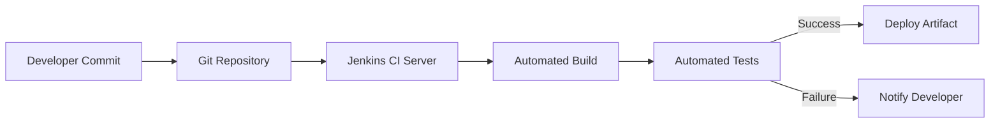
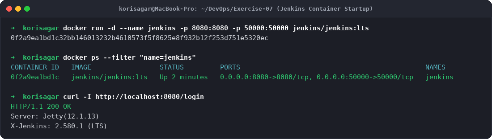
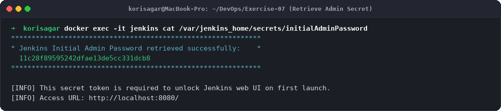
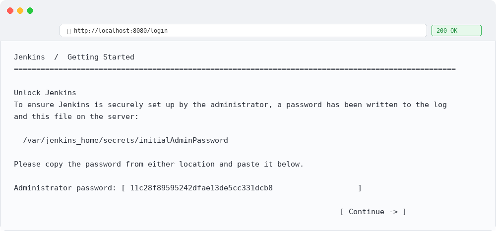
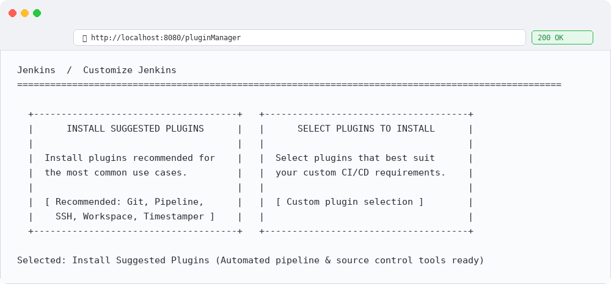
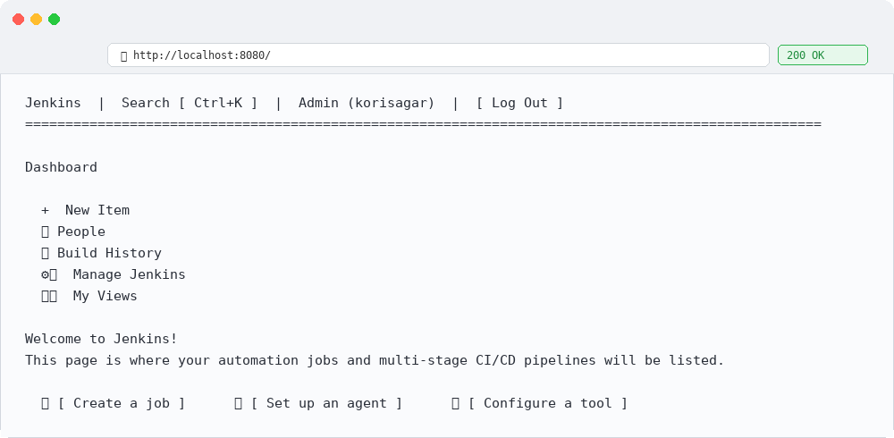

# Exercise 7: Introduction to Continuous Integration (CI) and Jenkins Installation

## Objective
The objective of this exercise is to:
- Understand the core principles, architecture, and operational benefits of **Continuous Integration (CI)**.
- Survey popular modern CI/CD orchestration tools across cloud and self-hosted environments.
- Gain hands-on experience installing, running, and configuring **Jenkins** using Docker containers.
- Learn how to retrieve the Jenkins initial administrator secret password and perform first-time setup and plugin initialization.

---

## What is Continuous Integration (CI)?
Continuous Integration is a software engineering practice where developers integrate their code into a shared repository frequently (often multiple times per day). Each commit triggers an automated build and test pipeline to detect integration bugs early, accelerate time-to-market, and enforce consistent code quality.

### Key Features of CI
1. **Frequent Integration:** Code changes are merged regularly rather than through large, delayed batch releases.
2. **Automated Builds:** Every commit automatically compiles binaries and resolves packaging dependencies.
3. **Automated Testing:** Unit, integration, and security regression test suites run automatically.
4. **Immediate Feedback:** Instant build notifications (via Slack, email, PR comments) alert developers of regressions within minutes.

### Benefits of CI
- **Early Bug Detection:** Catch syntax, logic, and dependency errors before code reaches staging or production.
- **Reduced Merge Conflicts:** Frequent updates eliminate the complexity of resolving large merge conflicts.
- **Enhanced Productivity:** Developers focus on building features rather than performing manual builds and verification tests.
- **Reliable Release Cadence:** High confidence in software stability through verifiable test coverage.

---

## How CI Works


1. **Code Commit:** Developer commits and pushes changes to GitHub/GitLab.
2. **Webhook / Trigger:** The CI server detects the new commit or receives a webhook notification.
3. **Automated Build:** The agent pulls source code, prepares the build container, and compiles dependencies.
4. **Automated Testing:** Automated test suites run in isolation.
5. **Feedback Loop:** Build logs and test reports are summarized and sent back to developers.

---

## Industry Survey: Leading CI/CD Tools

| Tool | Deployment Model | Key Highlights | Best Used For |
|---|---|---|---|
| **Jenkins** | Self-Hosted / Containerized | Open-source, massive plugin ecosystem (1800+ plugins), highly customizable | Enterprise & custom workflows |
| **GitHub Actions** | Cloud / Self-Hosted Runners | Native GitHub integration, YAML-based workflows, extensive Marketplace | GitHub-hosted repositories |
| **GitLab CI/CD** | Cloud & Self-Hosted | Built directly into GitLab, unified DevOps platform | End-to-end GitLab workflows |
| **CircleCI** | Cloud & On-Premises | Native Docker execution, parallelism, caching mechanisms | Fast container-centric pipelines |
| **Azure DevOps** | Cloud (Microsoft Azure) | Deep integration with Azure, Visual Studio, and multi-OS agents | Enterprise Microsoft environments |
| **TeamCity** | Self-Hosted & Cloud | JetBrains enterprise CI server with out-of-the-box build chains | Complex heterogeneous enterprise pipelines |
| **Travis CI** | Cloud | Pioneer in open-source CI, clean YAML configuration | Open-source public projects |
| **Drone** | Container-Native | Lightweight, uses Docker containers for each pipeline step | Minimalist container-first environments |

---

## Introduction to Jenkins Architecture

Jenkins is the leading open-source automation server. Key components include:
- **Controller (Master):** Serves the web UI, parses pipelines, manages configurations, and schedules builds.
- **Agents (Workers):** Machines (or ephemeral Docker containers) that execute build steps dispatched by the controller.
- **Job / Project:** A configurable automated task (e.g., Freestyle project, Pipeline, Multibranch).
- **Pipeline:** Code-defined workflow (`Jenkinsfile`) implementing multi-stage CI/CD lifecycles.
- **Plugins:** Modular add-ons extending Jenkins with Git, Docker, Kubernetes, and cloud provider capabilities.

---

## Step-by-Step Installation via Docker

### Step 1: Launch Jenkins LTS Container
Run the official Jenkins Long Term Support (LTS) image using Docker:
```bash
docker run -d --name jenkins -p 8080:8080 -p 50000:50000 jenkins/jenkins:lts
```
> **Port Mapping:**
> - `8080:8080`: Exposes the Jenkins HTTP Web GUI.
> - `50000:50000`: Dedicated inbound agent communication port (JNLP).

Verify the running container:
```bash
docker ps --filter "name=jenkins"
```
**Output:**
```
CONTAINER ID   IMAGE                 STATUS         PORTS                                              NAMES
0f2a9ea1bd1c   jenkins/jenkins:lts   Up 2 minutes   0.0.0.0:8080->8080/tcp, 0.0.0.0:50000->50000/tcp   jenkins
```

Verify HTTP connectivity:
```bash
curl -I http://localhost:8080/login
```
**Output:**
```
HTTP/1.1 200 OK
Server: Jetty(12.1.13)
X-Jenkins: 2.580.1 (LTS)
```

### Step 2: Retrieve Initial Admin Password
Jenkins generates a secure one-time secret during initialization. Extract it using:
```bash
docker exec -it jenkins cat /var/jenkins_home/secrets/initialAdminPassword
```
**Secret Token:**
```
11c28f89595242dfae13de5cc331dcb8
```

### Step 3: Complete First-Time Web Setup
1. Navigate to `http://localhost:8080` in your web browser.
2. Enter the generated administrator secret token to **Unlock Jenkins**.
3. Select **Install Suggested Plugins** to equip Jenkins with Git, Pipeline, Timestamper, and Workspace plugins.
4. Create the primary Administrator credentials and proceed to the main Jenkins Dashboard.

---

## Evidence & Step-by-Step Screenshots

### Step 1: Launching Jenkins Container

*Figure 1: Executing `docker run` and validating the active Jenkins container on port 8080.*

### Step 2: Retrieving Administrator Secret Token

*Figure 2: Reading `initialAdminPassword` from `/var/jenkins_home/secrets/initialAdminPassword`.*

### Step 3: Unlock Jenkins Web Interface

*Figure 3: Unlocking Jenkins through the browser setup wizard.*

### Step 4: Installing Recommended Plugins

*Figure 4: Selecting and installing standard CI/CD plugin suite.*

### Step 5: Jenkins Administrative Dashboard

*Figure 5: Welcome page of the Jenkins Automation Server ready for build job creation.*
