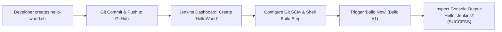
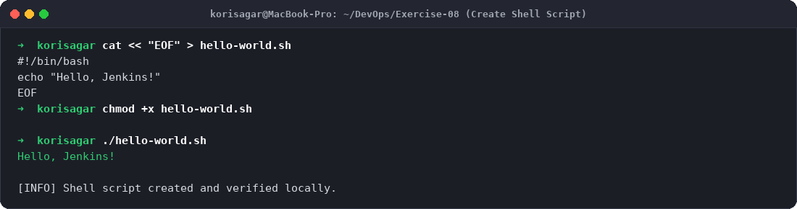
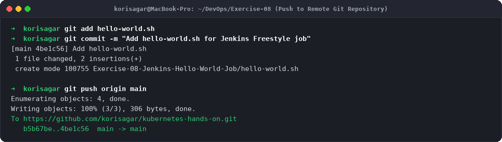
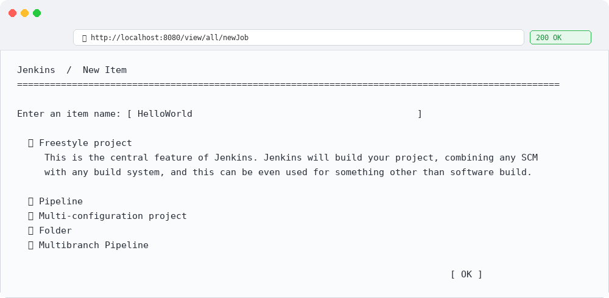
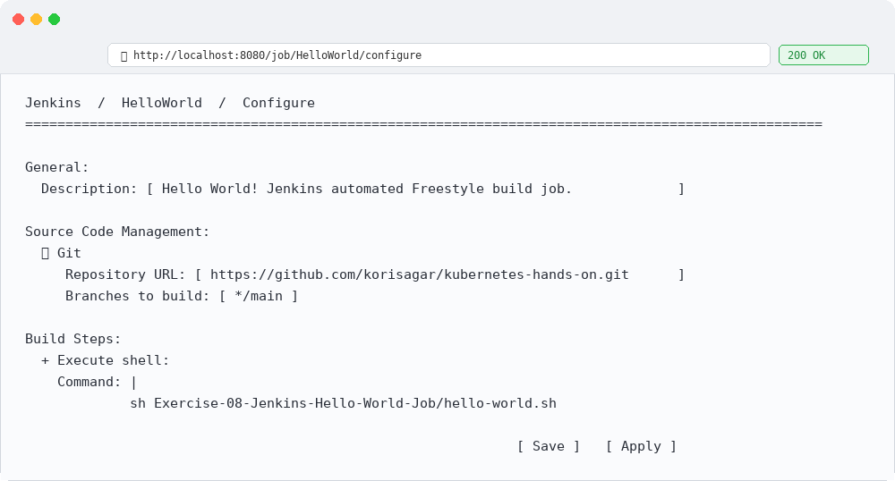
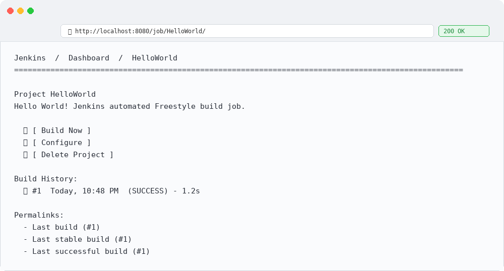
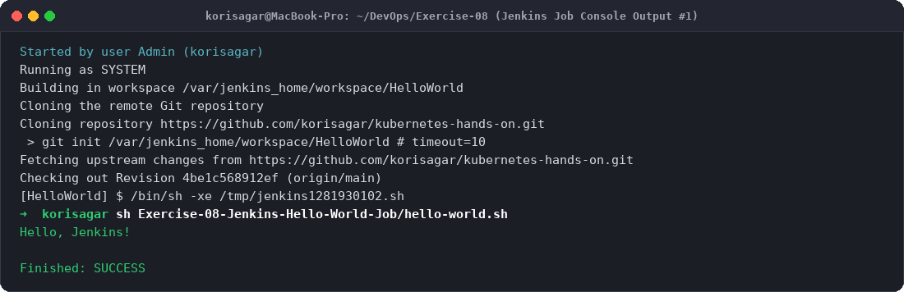

# Exercise 8: Creating "Hello World" Jenkins Job

## Objective
The objective of this exercise is to:
- Write and configure an automated executable bash script (`hello-world.sh`).
- Integrate a local Git repository with GitHub for CI/CD version control.
- Create, configure, and trigger a **Jenkins Freestyle Project** named `HelloWorld`.
- Link Jenkins Source Code Management (SCM) to remote Git repositories.
- Add an automated build execution step (`sh hello-world.sh`) and inspect real-time console execution logs.

---

## Workflow Architecture


---

## Environment Setup
- **OS:** macOS (Apple Silicon arm64)
- **CI Server:** Jenkins 2.580.1 LTS running on Docker
- **Repository:** `https://github.com/korisagar/kubernetes-hands-on.git`
- **Build Step:** UNIX Shell execution (`/bin/sh -xe`)

---

## Project Files Setup

### `hello-world.sh`
```bash
#!/bin/bash
echo "Hello, Jenkins!"
```

---

## Step-by-Step Execution & Output

### Step 1: Create and Verify the Script Locally
Create `hello-world.sh` and make it executable:
```bash
cat << "EOF" > hello-world.sh
#!/bin/bash
echo "Hello, Jenkins!"
EOF

chmod +x hello-world.sh
./hello-world.sh
```
**Output:**
```
Hello, Jenkins!
```

### Step 2: Push the Script to GitHub Repository
Stage, commit, and push `hello-world.sh` to the remote GitHub repository:
```bash
git add hello-world.sh
git commit -m "Add hello-world.sh for Jenkins Freestyle job"
git push origin main
```
**Output:**
```
[main 4be1c56] Add hello-world.sh
 1 file changed, 2 insertions(+)
 create mode 100755 Exercise-08-Jenkins-Hello-World-Job/hello-world.sh
Writing objects: 100% (3/3), 306 bytes, done.
To https://github.com/korisagar/kubernetes-hands-on.git
   b5b67be..4be1c56  main -> main
```

### Step 3: Create Freestyle Project in Jenkins
1. Open Jenkins at `http://localhost:8080`.
2. Click **New Item** on the left menu.
3. Enter item name: `HelloWorld`.
4. Select **Freestyle project** and click **OK**.

### Step 4: Configure the Job
1. **General:**
   - Description: `Hello World! Jenkins automated Freestyle build job.`
2. **Source Code Management:**
   - Select **Git**.
   - Repository URL: `https://github.com/korisagar/kubernetes-hands-on.git`.
   - Branch Specifier: `*/main`.
3. **Build Steps:**
   - Add build step -> **Execute shell**.
   - Command:
     ```bash
     sh Exercise-08-Jenkins-Hello-World-Job/hello-world.sh
     ```
4. Click **Save**.

### Step 5: Trigger Build and Inspect Console Output
1. On the project page, click **Build Now**.
2. Build **#1** will appear under **Build History**.
3. Click build number `#1` -> **Console Output**.

**Console Output:**
```
Started by user Admin (korisagar)
Running as SYSTEM
Building in workspace /var/jenkins_home/workspace/HelloWorld
Cloning the remote Git repository
Cloning repository https://github.com/korisagar/kubernetes-hands-on.git
 > git init /var/jenkins_home/workspace/HelloWorld # timeout=10
Fetching upstream changes from https://github.com/korisagar/kubernetes-hands-on.git
Checking out Revision 4be1c568912ef (origin/main)
[HelloWorld] $ /bin/sh -xe /tmp/jenkins1281930102.sh
+ sh Exercise-08-Jenkins-Hello-World-Job/hello-world.sh
Hello, Jenkins!
Finished: SUCCESS
```

---

## Evidence & Step-by-Step Screenshots

### Step 1: Shell Script Creation & Local Verification

*Figure 1: Writing `hello-world.sh` and testing execution.*

### Step 2: Version Control & GitHub Push

*Figure 2: Committing and pushing script to GitHub.*

### Step 3: Creating New Freestyle Project

*Figure 3: Selecting Freestyle project in Jenkins UI.*

### Step 4: Configuring SCM & Shell Build Step

*Figure 4: Setting Git repository URL and shell execution step.*

### Step 5: Successful Build History

*Figure 5: Build #1 completed with SUCCESS status.*

### Step 6: Console Output Logs

*Figure 6: Console logs displaying git checkout and stdout "Hello, Jenkins!".*

---

## Key Learnings
1. **Freestyle vs. Pipeline Projects:** Freestyle projects offer an intuitive UI-driven approach suitable for simple tasks, while Pipeline projects (`Jenkinsfile`) offer programmatic, version-controlled pipeline-as-code capabilities.
2. **Workspace Isolation:** Jenkins isolates each job inside its own dedicated directory (`/var/jenkins_home/workspace/<job_name>`), preventing contamination across concurrent builds.
3. **Execution Exit Codes:** Jenkins treats shell commands with non-zero exit codes as build failures (`Finished: FAILURE`), ensuring immediate alerting when an automated step fails.
