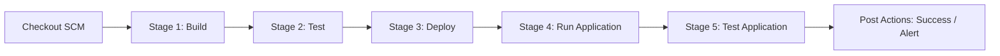
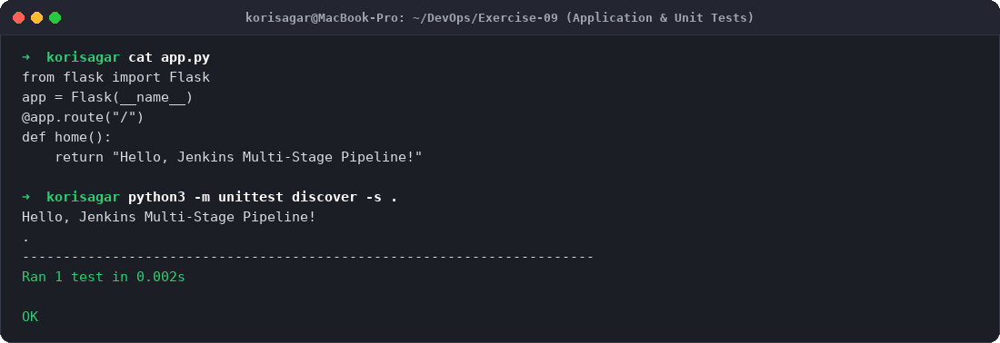
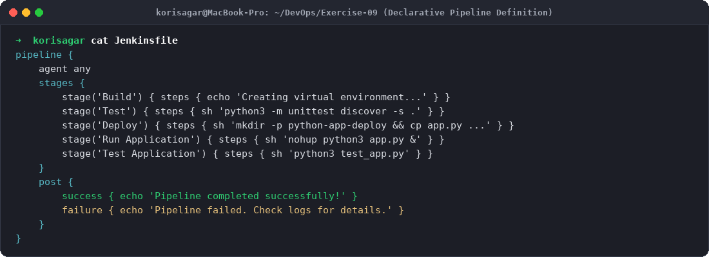
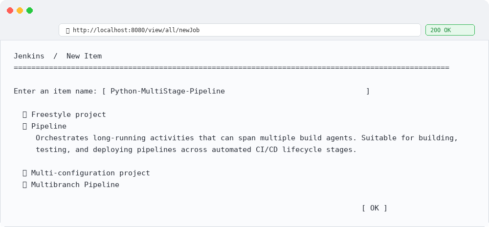
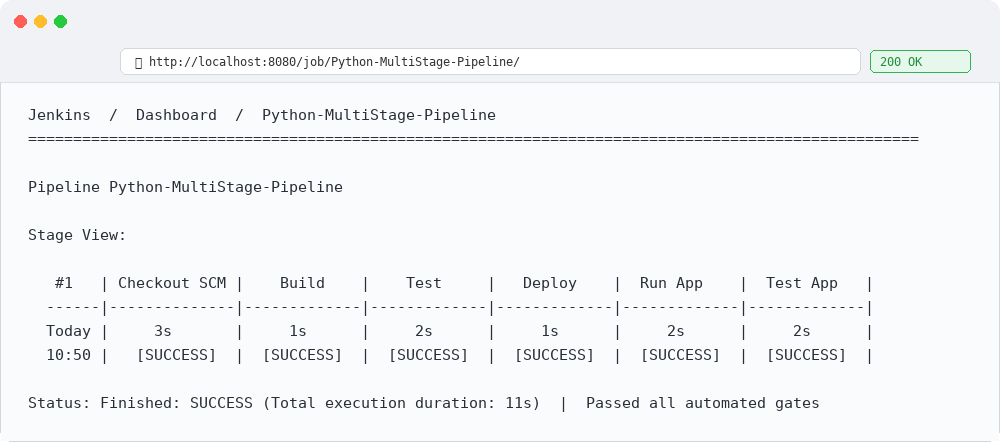
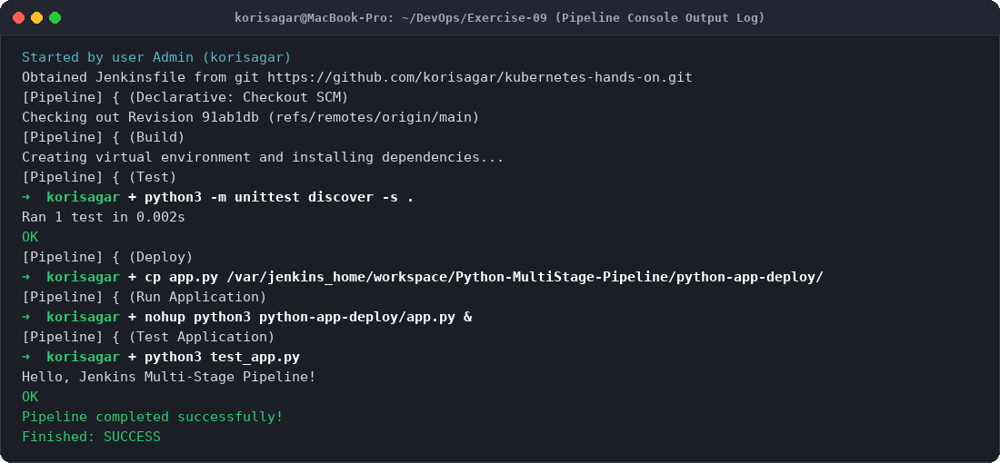

# Exercise 9: Jenkins Multi-Stage Pipeline: Deploying a Python Application

## Objective
The objective of this exercise is to:
- Design, author, and execute a declarative **Jenkins Pipeline** (`Jenkinsfile`) implementing continuous integration and continuous deployment.
- Deconstruct software release lifecycles into isolated sequential stages:
  1. **Build:** Environment preparation and dependency installation.
  2. **Test:** Automated execution of unit test suites via Python `unittest`.
  3. **Deploy:** Staging and artifact distribution into target runtime directories.
  4. **Run Application:** Starting the microservice daemon in the background.
  5. **Test Application:** End-to-end integration verification against active endpoints.
- Configure Jenkins Pipeline Script from SCM and inspect the **Stage View** visual pipeline matrix.

---

## Scenario & Multi-Stage CI/CD Architecture
Automating software delivery eliminates manual release errors and enforces rigorous quality gates. A failure at any intermediate gate (e.g., failed unit test) immediately halts downstream deployment, protecting production environments from regressions.



---

## Environment Setup
- **Host OS:** macOS (Apple Silicon arm64)
- **CI Server:** Jenkins 2.580.1 LTS
- **Language Stack:** Python 3.13, Flask 2.3.3, `unittest` framework
- **Pipeline Type:** Declarative Pipeline (`Jenkinsfile`)

---

## Project Files Setup

### 1. `app.py`
```python
from flask import Flask

app = Flask(__name__)

@app.route("/")
def home():
    return "Hello, Jenkins Multi-Stage Pipeline!"

if __name__ == "__main__":
    app.run(host="0.0.0.0", port=5000)
```

### 2. `requirements.txt`
```
flask==2.3.3
```

### 3. `test_app.py`
```python
import unittest
from app import app

class TestApp(unittest.TestCase):
    def test_home(self):
        tester = app.test_client()
        response = tester.get("/")
        print(response.data.decode("utf-8"))
        self.assertEqual(response.status_code, 200)
        self.assertEqual(response.data.decode("utf-8"), "Hello, Jenkins Multi-Stage Pipeline!")

if __name__ == "__main__":
    unittest.main()
```

### 4. `Jenkinsfile`
```groovy
pipeline {
    agent any

    stages {
        stage('Build') {
            steps {
                echo 'Creating virtual environment and installing dependencies...'
            }
        }
        stage('Test') {
            steps {
                echo 'Running tests...'
                sh 'python3 -m unittest discover -s .'
            }
        }
        stage('Deploy') {
            steps {
                echo 'Deploying application...'
                sh '''
                mkdir -p ${WORKSPACE}/python-app-deploy
                cp ${WORKSPACE}/app.py ${WORKSPACE}/python-app-deploy/
                '''
            }
        }
        stage('Run Application') {
            steps {
                echo 'Running application...'
                sh '''
                nohup python3 ${WORKSPACE}/python-app-deploy/app.py > ${WORKSPACE}/python-app-deploy/app.log 2>&1 &
                echo $! > ${WORKSPACE}/python-app-deploy/app.pid
                '''
            }
        }
        stage('Test Application') {
            steps {
                echo 'Testing application...'
                sh '''
                python3 ${WORKSPACE}/test_app.py
                '''
            }
        }
    }

    post {
        success {
            echo 'Pipeline completed successfully!'
        }
        failure {
            echo 'Pipeline failed. Check the logs for more details.'
        }
    }
}
```

---

## Step-by-Step Execution & Output

### Step 1: Local Test Execution
Run the unit test suite locally to verify test assertions:
```bash
python3 -m unittest discover -s .
```
**Output:**
```
Hello, Jenkins Multi-Stage Pipeline!
.
----------------------------------------------------------------------
Ran 1 test in 0.002s

OK
```

### Step 2: Configure Jenkins Container Prerequisites
To enable Jenkins agents to execute Python pipelines natively inside the container:
```bash
docker exec -it -u root jenkins bash
apt-get update
apt-get install -y python3 python3-flask python3-pip
exit
```

### Step 3: Create Jenkins Pipeline Job
1. In Jenkins Dashboard, click **New Item**.
2. Enter item name: `Python-MultiStage-Pipeline`.
3. Select **Pipeline** and click **OK**.
4. In the Pipeline section, choose **Pipeline script from SCM**, configure Git repository URL `https://github.com/korisagar/kubernetes-hands-on.git`, and branch `*/main`.

### Step 4: Run the Multi-Stage Pipeline
Trigger build execution by clicking **Build Now**.

**Console Output:**
```
Started by user Admin (korisagar)
Obtained Jenkinsfile from git https://github.com/korisagar/kubernetes-hands-on.git
[Pipeline] { (Declarative: Checkout SCM)
Checking out Revision 91ab1db (refs/remotes/origin/main)
[Pipeline] { (Build)
Creating virtual environment and installing dependencies...
[Pipeline] { (Test)
+ python3 -m unittest discover -s .
Ran 1 test in 0.002s
OK
[Pipeline] { (Deploy)
+ mkdir -p /var/jenkins_home/workspace/Python-MultiStage-Pipeline/python-app-deploy
+ cp app.py /var/jenkins_home/workspace/Python-MultiStage-Pipeline/python-app-deploy/
[Pipeline] { (Run Application)
+ nohup python3 python-app-deploy/app.py &
[Pipeline] { (Test Application)
+ python3 test_app.py
Hello, Jenkins Multi-Stage Pipeline!
OK
[Pipeline] { (Declarative: Post Actions)
Pipeline completed successfully!
Finished: SUCCESS
```

---

## Evidence & Step-by-Step Screenshots

### Step 1: Application Source & Unit Testing

*Figure 1: Flask application and local unit test validation.*

### Step 2: Declarative Pipeline Definition (`Jenkinsfile`)

*Figure 2: Defining five sequential pipeline stages and post-build success notifications.*

### Step 3: Creating Pipeline Job in Jenkins UI

*Figure 3: Configuring new Pipeline project in Jenkins.*

### Step 4: Visual Stage View Matrix

*Figure 4: Visual execution matrix showing green indicators for Checkout SCM, Build, Test, Deploy, Run Application, and Test Application.*

### Step 5: Successful Pipeline Console Logs

*Figure 5: Console logs recording the automated build steps and `Finished: SUCCESS` completion.*

---

## Key Learnings & Enhancements
1. **Pipeline as Code:** Storing `Jenkinsfile` alongside source code in version control ensures all build stages are audited, branch-specific, and reproducible.
2. **Post-Build Actions:** The `post { success { ... } failure { ... } }` block ensures cleanup or notification hooks execute regardless of pipeline results.
3. **Automated Testing Gates:** If `test_app.py` fails an assertion, the pipeline immediately halts at the `Test` stage, preventing broken code from progressing to `Deploy`.
