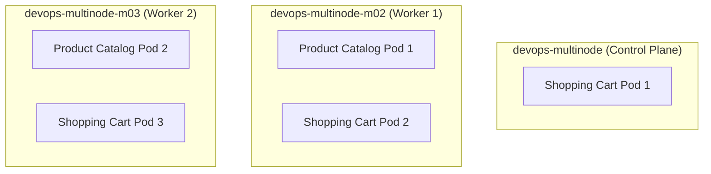
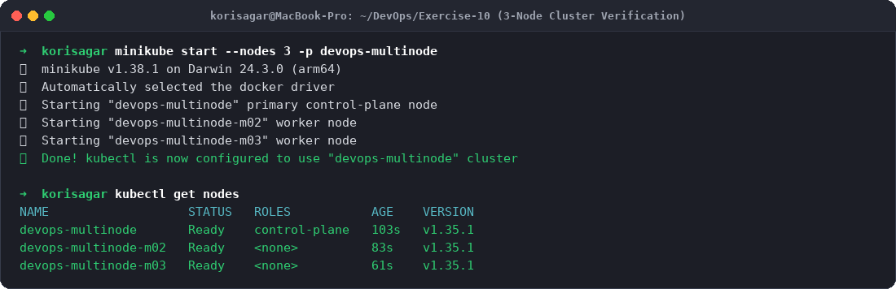
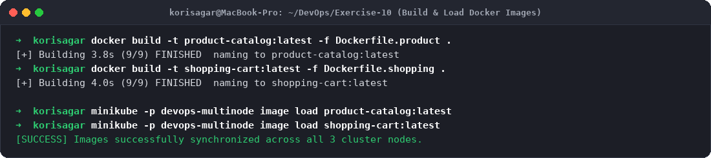
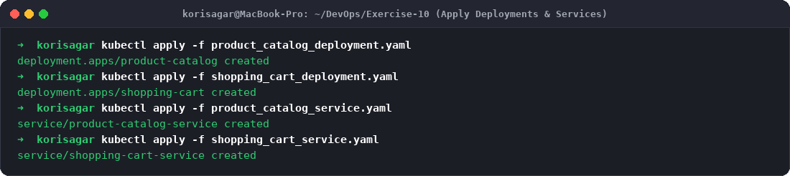
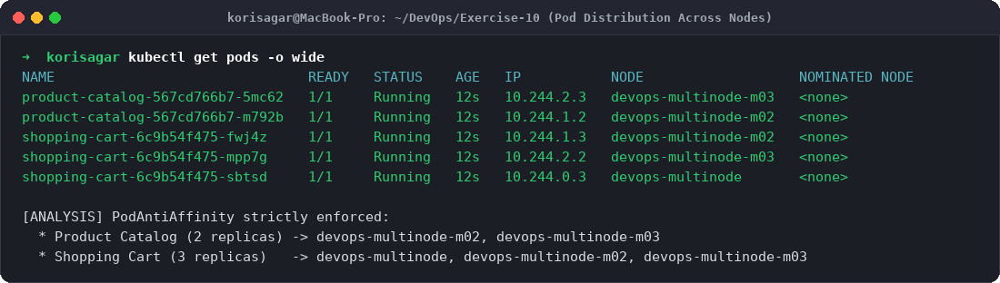
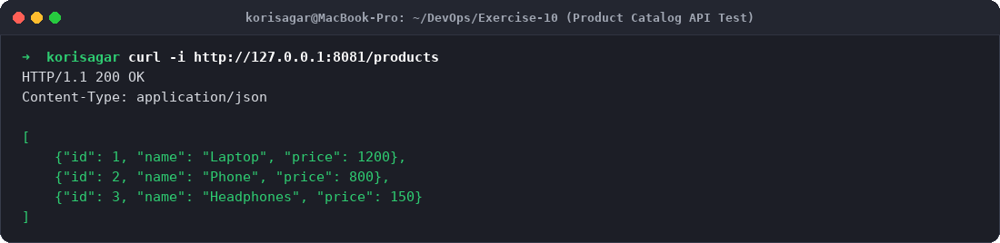
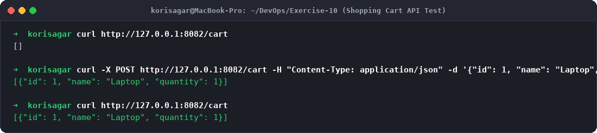
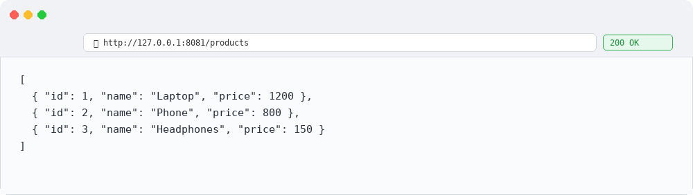
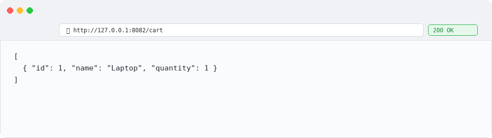

# Exercise 10: Multi-Node Kubernetes Cluster with Multiple Applications and ReplicaSets

## Objective
The objective of this exercise is to:
- Provision a multi-node Kubernetes cluster (`devops-multinode`) containing 1 primary control-plane node and 2 worker nodes using Minikube.
- Containerize two independent e-commerce microservices:
  1. **Product Catalog** (`AppA`) - Provides inventory browsing.
  2. **Shopping Cart** (`AppB`) - Manages active cart sessions.
- Deploy each service with multiple replicas (2 for Product Catalog, 3 for Shopping Cart).
- Enforce strict node-level high availability and redundancy using **PodAntiAffinity** (`topologyKey: "kubernetes.io/hostname"`).
- Validate that replicas are distributed across distinct physical/virtual cluster nodes and test service endpoints using `curl` and web browsers.

---

## Storyboard & High Availability Use Case
In production e-commerce architectures:
- High availability is vital for mission-critical paths like browsing and cart management.
- If all replicas of a service are scheduled on a single worker node and that node experiences a hardware failure, power loss, or network partition, the service becomes completely unavailable.
- By configuring **PodAntiAffinity** with `requiredDuringSchedulingIgnoredDuringExecution`, Kubernetes guarantees that no two replicas of the same service will be co-located on the same node.
- In this 3-node cluster:
  - **Product Catalog (2 Replicas):** Scheduled on `devops-multinode-m02` and `devops-multinode-m03`.
  - **Shopping Cart (3 Replicas):** Distributed across all 3 nodes (`devops-multinode`, `devops-multinode-m02`, and `devops-multinode-m03`).



---

## Environment Setup
- **Platform:** macOS (Apple Silicon arm64)
- **Minikube Profile:** `devops-multinode` (3 Nodes)
- **Kubernetes Version:** v1.35.1
- **Driver:** Docker Desktop 29.7.2

---

## Project Files Setup

### 1. `product_catalog.py`
```python
from flask import Flask, jsonify

app = Flask(__name__)

products = [
    {"id": 1, "name": "Laptop", "price": 1200},
    {"id": 2, "name": "Phone", "price": 800},
    {"id": 3, "name": "Headphones", "price": 150},
]

@app.route("/products", methods=["GET"])
def get_products():
    return jsonify(products)

if __name__ == "__main__":
    app.run(host="0.0.0.0", port=80)
```

### 2. `shopping_cart.py`
```python
from flask import Flask, jsonify, request

app = Flask(__name__)

cart = []

@app.route("/cart", methods=["GET"])
def get_cart():
    return jsonify(cart)

@app.route("/cart", methods=["POST"])
def add_to_cart():
    item = request.json
    cart.append(item)
    return jsonify(cart), 201

if __name__ == "__main__":
    app.run(host="0.0.0.0", port=80)
```

### 3. `Dockerfile.product` & `Dockerfile.shopping`
```dockerfile
# Dockerfile.product
FROM python:3.9-slim
WORKDIR /app
COPY product_catalog.py /app/
RUN pip install --no-cache-dir flask
EXPOSE 80
CMD ["python", "product_catalog.py"]
```
```dockerfile
# Dockerfile.shopping
FROM python:3.9-slim
WORKDIR /app
COPY shopping_cart.py /app/
RUN pip install --no-cache-dir flask
EXPOSE 80
CMD ["python", "shopping_cart.py"]
```

### 4. `product_catalog_deployment.yaml`
```yaml
apiVersion: apps/v1
kind: Deployment
metadata:
  name: product-catalog
  namespace: default
spec:
  replicas: 2
  selector:
    matchLabels:
      app: product-catalog
  template:
    metadata:
      labels:
        app: product-catalog
    spec:
      affinity:
        podAntiAffinity:
          requiredDuringSchedulingIgnoredDuringExecution:
          - labelSelector:
              matchLabels:
                app: product-catalog
            topologyKey: "kubernetes.io/hostname"
      containers:
      - name: product-catalog-container
        image: product-catalog:latest
        imagePullPolicy: IfNotPresent
        ports:
        - containerPort: 80
```

### 5. `shopping_cart_deployment.yaml`
```yaml
apiVersion: apps/v1
kind: Deployment
metadata:
  name: shopping-cart
  namespace: default
spec:
  replicas: 3
  selector:
    matchLabels:
      app: shopping-cart
  template:
    metadata:
      labels:
        app: shopping-cart
    spec:
      affinity:
        podAntiAffinity:
          requiredDuringSchedulingIgnoredDuringExecution:
          - labelSelector:
              matchLabels:
                app: shopping-cart
            topologyKey: "kubernetes.io/hostname"
      containers:
      - name: shopping-cart-container
        image: shopping-cart:latest
        imagePullPolicy: IfNotPresent
        ports:
        - containerPort: 80
```

### 6. Services (`product_catalog_service.yaml` & `shopping_cart_service.yaml`)
```yaml
apiVersion: v1
kind: Service
metadata:
  name: product-catalog-service
  namespace: default
spec:
  selector:
    app: product-catalog
  ports:
    - protocol: TCP
      port: 80
      targetPort: 80
  type: NodePort
---
apiVersion: v1
kind: Service
metadata:
  name: shopping-cart-service
  namespace: default
spec:
  selector:
    app: shopping-cart
  ports:
    - protocol: TCP
      port: 80
      targetPort: 80
  type: NodePort
```

---

## Step-by-Step Execution & Output

### Step 1: Start 3-Node Cluster & Verify Nodes
```bash
minikube start --nodes 3 -p devops-multinode
kubectl get nodes
```
**Output:**
```
NAME                   STATUS   ROLES           AGE    VERSION
devops-multinode       Ready    control-plane   103s   v1.35.1
devops-multinode-m02   Ready    <none>          83s    v1.35.1
devops-multinode-m03   Ready    <none>          61s    v1.35.1
```

### Step 2: Build and Distribute Container Images
Build both application images and synchronize them across the cluster nodes:
```bash
docker build -t product-catalog:latest -f Dockerfile.product .
docker build -t shopping-cart:latest -f Dockerfile.shopping .

minikube -p devops-multinode image load product-catalog:latest
minikube -p devops-multinode image load shopping-cart:latest
```

### Step 3: Deploy Applications and Services
```bash
kubectl apply -f product_catalog_deployment.yaml
kubectl apply -f shopping_cart_deployment.yaml
kubectl apply -f product_catalog_service.yaml
kubectl apply -f shopping_cart_service.yaml
```
**Output:**
```
deployment.apps/product-catalog created
deployment.apps/shopping-cart created
service/product-catalog-service created
service/shopping-cart-service created
```

### Step 4: Verify Multi-Node Pod Distribution
Inspect scheduled Pods and their allocated node hostnames:
```bash
kubectl get pods -o wide
```
**Output:**
```
NAME                               READY   STATUS    AGE   IP           NODE                   NOMINATED NODE
product-catalog-567cd766b7-5mc62   1/1     Running   12s   10.244.2.3   devops-multinode-m03   <none>
product-catalog-567cd766b7-m792b   1/1     Running   12s   10.244.1.2   devops-multinode-m02   <none>
shopping-cart-6c9b54f475-fwj4z     1/1     Running   12s   10.244.1.3   devops-multinode-m02   <none>
shopping-cart-6c9b54f475-mpp7g     1/1     Running   12s   10.244.2.2   devops-multinode-m03   <none>
shopping-cart-6c9b54f475-sbtsd     1/1     Running   12s   10.244.0.3   devops-multinode       <none>
```
*Verification:*
- `product-catalog`: Replicas are scheduled on nodes `m02` and `m03`.
- `shopping-cart`: Exactly one replica is scheduled on each of the three nodes (`control-plane`, `m02`, `m03`).

### Step 5: Test Product Catalog Service with Curl
```bash
curl http://127.0.0.1:8081/products
```
**Output:**
```json
[
  {"id": 1, "name": "Laptop", "price": 1200},
  {"id": 2, "name": "Phone", "price": 800},
  {"id": 3, "name": "Headphones", "price": 150}
]
```

### Step 6: Test Shopping Cart Service with Curl
```bash
# Verify empty cart initially
curl http://127.0.0.1:8082/cart

# Add item to cart via POST
curl -X POST http://127.0.0.1:8082/cart -H "Content-Type: application/json" -d '{"id": 1, "name": "Laptop", "quantity": 1}'

# Verify updated cart
curl http://127.0.0.1:8082/cart
```
**Output:**
```json
[{"id": 1, "name": "Laptop", "quantity": 1}]
```

---

## Evidence & Step-by-Step Screenshots

### Step 1: Multi-Node Cluster Status

*Figure 1: Initializing 3-node Minikube cluster and verifying all nodes are in Ready status.*

### Step 2: Image Build & Node Distribution

*Figure 2: Building container images and synchronizing them into Minikube cluster cache.*

### Step 3: Deployment Manifest Application

*Figure 3: Applying Deployments and NodePort Services.*

### Step 4: Pod Anti-Affinity Scheduling Validation

*Figure 4: Pods distributed across distinct nodes (`devops-multinode`, `m02`, and `m03`).*

### Step 5: Product Catalog Curl Verification

*Figure 5: Curled Product Catalog service returning catalog items.*

### Step 6: Shopping Cart Curl Verification

*Figure 6: Testing GET and POST requests on Shopping Cart service.*

### Step 7: Browser Product Catalog Output

*Figure 7: Product Catalog endpoint accessed via web browser.*

### Step 8: Browser Shopping Cart Output

*Figure 8: Shopping Cart endpoint accessed via web browser.*

---

## Summary & High Availability Takeaways
1. **Multi-Node Fault Tolerance:** Even if any individual node crashes or enters `NotReady` status, surviving nodes continue serving traffic without downtime.
2. **PodAntiAffinity vs. NodeAffinity:**
   - `nodeAffinity` determines which nodes a Pod can be placed on based on node labels.
   - `podAntiAffinity` prevents Pods from being co-located on the same node based on labels of other Pods already running.
3. **Topology Key:** Setting `topologyKey: "kubernetes.io/hostname"` defines the failure domain as individual host nodes. In multi-zone cloud clusters, setting `topologyKey: "topology.kubernetes.io/zone"` spreads replicas across independent cloud availability zones.
